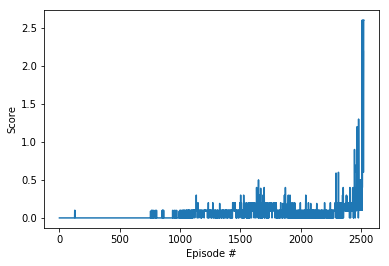

# Report

## Learning Algorithm

### (Multi-Agent)DDPG
Hyperparameters in `code/Tennis.ipynb`, `code/ddpg_agent.py`
- Agent
	- `BUFFER_SIZE` = 1000000
		- replay buffer size
	- `BATCH_SIZE` = 128
		- minibatch size
	- `GAMMA` = 0.99
		- discount factor
	- `TAU` = 1e-3
		- for soft update of target parameters
	- `LR_ACTOR` = 1e-3
		- learning rate of the actor
	- `LR_CRITIC` = 1e-3
		- learning rate of the critic
	- `WEIGHT_DECAY` = 0
		- L2 weight decay
- OUNoise
	- `mu` = 0
		- the mean
	- `theta` = 0.15
		- how quickly to return to the mean
	- `sigma` = 0.2
		- the variability of the process


### NN Model Architecture: Actor, Critic
Actor NN model consists of 3 `torch.nn.Linear` layers, and the activation functions of the 1st and 2nd layer is `torch.nn.functional.relu`, of 3rd layer is `torch.nn.functional.tanh`.
Batch normalization was performed on the output of the first linear layer.
- input shape: `(24,)`
- output shape: `(2,)`
- (The first argument value of the shape shown below indicates the batch size.)

```
----------------------------------------------------------------
        Layer (type)               Output Shape         Param #
================================================================
            Linear-1                  [-1, 128]           3,200
       BatchNorm1d-2                  [-1, 128]             256
            Linear-3                  [-1, 128]          16,512
            Linear-4                    [-1, 2]             258
================================================================
```

Critic NN model consists of 3 `torch.nn.Linear` layers, and the activation functions of the 1st and 2nd layer is `torch.nn.functional.relu`.
Batch normalization was performed on the output of the first linear layer.
- input shape: `[(24,), (2,)]`
- output shape: `(1,)`
- (The first argument value of the shape shown below indicates the batch size.)

```
----------------------------------------------------------------
        Layer (type)               Output Shape         Param #
================================================================
            Linear-1                  [-1, 128]           3,200
       BatchNorm1d-2                  [-1, 128]             256
            Linear-3                  [-1, 128]          16,768
            Linear-4                    [-1, 1]             129
================================================================
```

## Plot of Rewards
Environment solved in 2525 episodes!
- Average Score: 0.51



## Ideas for Future Work
In this project, I experimented with only a few combinations of learning rate and unit size of the network. If I had experimented by creating a scenario with a combination of more various hyper parameters, I think I could have made a learning model that converges faster. The learning reward rapidly rises at a specific point, then plummets and cannot be recovered. I think I need to think about how to make high rewards last a little longer.